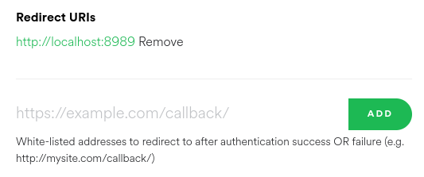

# spotify_mood

A CLI tool for searching liked songs based on genre.

Has the ability to create playlists based on genre searches.

## Authentication

To use the tool you need to first authenticate with Spotify. Sadly for client side OAuth you need to first create a developer application, you can find information on achieving this [here](https://developer.spotify.com/documentation/general/guides/app-settings/)

This should net you a `client_id` and `client_secret`.

You additionally need to set a Redirect URI in the app's settings in the developer dashboard, Spotipy will spin up a local webserver to capture access and refresh tokens if you specify a port, this is the recommended approach as it saves manually copying the values from the browsers url. Set a Redirect URI of `http://localhost:8989` for example:



These three values (`client_id`, `client_secret` & `redirect_uri`) should be passed to the SpotipyOAuth module. The easiest way to do this without modifying the source is to create a local file called `spotify_auth.py` inline with `spotify_mood.py` and fill it with the following content:

```python
client_id = 'xxxxxxxxxxxxxxxxxxxxxxxxxxxxxxxx'
client_secret = 'xxxxxxxxxxxxxxxxxxxxxxxxxxxxxxxx'
redirect_uri = 'http://localhost:8989'
```

| :memo: Note                                                    |
|:---------------------------------------------------------------|
| Authentication can be reset by deleting the inline .cache file |


## Example Usage
`spotify_mood` provides different ways to search your liked song library. You can perform genre searches to retrieve songs associated with a certain genre:
```bash
$ ./spotify_mood.py -s jazz
My Queen Is Harriet Tubman
        artist: Sons Of Kemet
        album: Your Queen Is A Reptile
        genres: ['afrofuturism', 'british jazz', 'chamber psych', 'contemporary jazz', 'indie jazz', 'progressive jazz fusion', 'uk contemporary jazz']
Shine
        artist: Seb Zillner
        album: ZILLNER
        genres: ['lo-fi jazzhop']
...
Found 50 songs
```

Or can perform specific key searches against artist, album or track names:

```bash
$ ./spotify_mood.py -k artist kindo
Hold Out
        artist: The Reign of Kindo
        album: Rhythm, Chord & Melody
        genres: ['piano rock', 'progressive post-hardcore']
The Moments In Between
        artist: The Reign of Kindo
        album: Rhythm, Chord & Melody
        genres: ['piano rock', 'progressive post-hardcore']
The Hero, The Saint, The Tyrant, & The Terrorist
        artist: The Reign of Kindo
        album: Play with Fire
        genres: ['piano rock', 'progressive post-hardcore']

Found 3 songs
```

All of these searches can optionally be added to a playlist, if no name is specified for a given playlist, a date stamp is used as a placeholder value:

```bash
$ ./spotify_mood.py -s jazz -c 'jazzy beats'
My Queen Is Harriet Tubman
        artist: Sons Of Kemet
        album: Your Queen Is A Reptile
        genres: ['afrofuturism', 'british jazz', 'chamber psych', 'contemporary jazz', 'indie jazz', 'progressive jazz fusion', 'uk contemporary jazz']
...
Added 50 items to playlist 'jazzy beats'
```


You can run `spotify_mood` with the `-f` flag to refresh the database if you have liked additional songs since last run.

## Help

```bash
usage: spotify_mood.py [-h] [-s [term]] [-k [key [term ...]]] [-l] [-c [name]] [-f]

search spotify liked songs based on genre

optional arguments:
  -h, --help            show this help message and exit
  -s [term], --search [term]
                        search genres for a term
  -k [key [term ...]], --key-search [key [term ...]]
                        search a specific key for a term
  -l, --list            list unique genres present in liked songs
  -c [name], --create-playlist [name]
                        create a playlist
  -f, --force-refresh   generate fresh database from spotify (delete cache)
```


